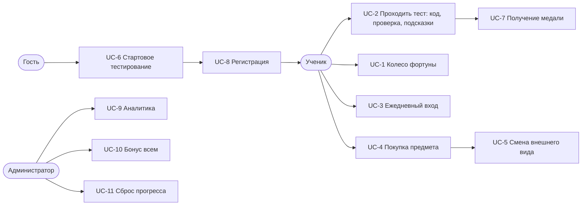

# 1. Контекст приложения

## Задача

Человек решает изучить Python и упирается в две проблемы.

Первая — **непонятно, с чего начинать**. Курсы либо предполагают нулевой уровень и утомляют
того, кто уже знает основы, либо начинают со среднего и теряют новичка на второй неделе.

Вторая — **не хватает причины возвращаться завтра**. Мотивация «надо выучить» держится
несколько дней. Дальше нужен внешний повод, и у обучающих продуктов его обычно нет.

CodeHogwarts решает обе: маршрут собирается после короткой диагностики, а возвращаться заставляет
игровой контур — монеты за практику, серии дней и персонаж, которого видно, как он растёт.

## Почему это не «ещё один курс»

| Обычный курс | CodeHogwarts |
|---|---|
| Один поток для всех | Маршрут по результату диагностики и найденным пробелам |
| Проверка по эталону строки | **Код запускается и прогоняется тестами** |
| Прогресс в процентах | Прогресс виден на персонаже: одежда, скин, транспорт, дом |
| Мотивация «надо» | Серия дней, монеты, колесо |

## Целевая аудитория

| Сегмент | Что ему нужно | Что получает |
|---|---|---|
| Полный новичок | Не испугаться и получить первый успех быстро | Первый урок открывается мгновенно, задания по 5 минут |
| Знает основы | Не тратить время на то, что уже умеет | Диагностика отправляет сразу в средний маршрут |
| Готовится к собеседованию | Точечно закрыть пробелы | Продвинутый маршрут: замыкания, генераторы, декораторы |

## Варианты использования

### Описание вариантов использования

Нумерация UC-1…UC-7 совпадает с файлом `use-cases.md` в репозитории проектной
документации. Номера с UC-8 — сценарии, которых там нет, но которые приложение
выполняет.

| № | Актор | Вариант использования | Результат |
|---|---|---|---|
| UC-1 | Ученик | Крутить колесо фортуны | Начислены монеты, вращение списано |
| UC-2 | Ученик | Проходить тест: решать задания, получать проверку и подсказки | Код исполнен в песочнице, показан разбор по каждому тесту; после теста — мем и монеты |
| UC-3 | Ученик | Поддерживать ежедневный вход, «огонёк» | Счётчик серии обновлён, начислен бонус дня |
| UC-4 | Ученик | Купить предмет в магазине | Списаны монеты, предмет добавлен в инвентарь одной транзакцией |
| UC-5 | Ученик | Сменить внешний вид персонажа | Предмет надет или снят, персонаж перерисован на всех экранах |
| UC-6 | Гость | Пройти стартовое тестирование | Определён уровень, назначен стартовый модуль, найдены слабые темы |
| UC-7 | Ученик | Получить медаль | Условие проверено, медаль привязана к профилю и показана |
| UC-8 | Гость | Зарегистрироваться | Создан аккаунт, результат теста привязан, собран персональный курс |
| UC-9 | Администратор | Смотреть аналитику | Воронка, этапы пользователей, экономика |
| UC-10 | Администратор | Начислить бонус всем | Монеты падают каждому при следующем входе |
| UC-11 | Администратор | Сбросить прогресс | Обнулён курс, монеты, инвентарь |

## Границы проекта

**Входит:** диагностика, генерация курса, исполнение кода, экономика, магазин, админ-панель,
три языка интерфейса.

**Не входит:** оплата реальными деньгами, мобильные приложения, соревнования между
пользователями, видеоуроки, сертификаты.
