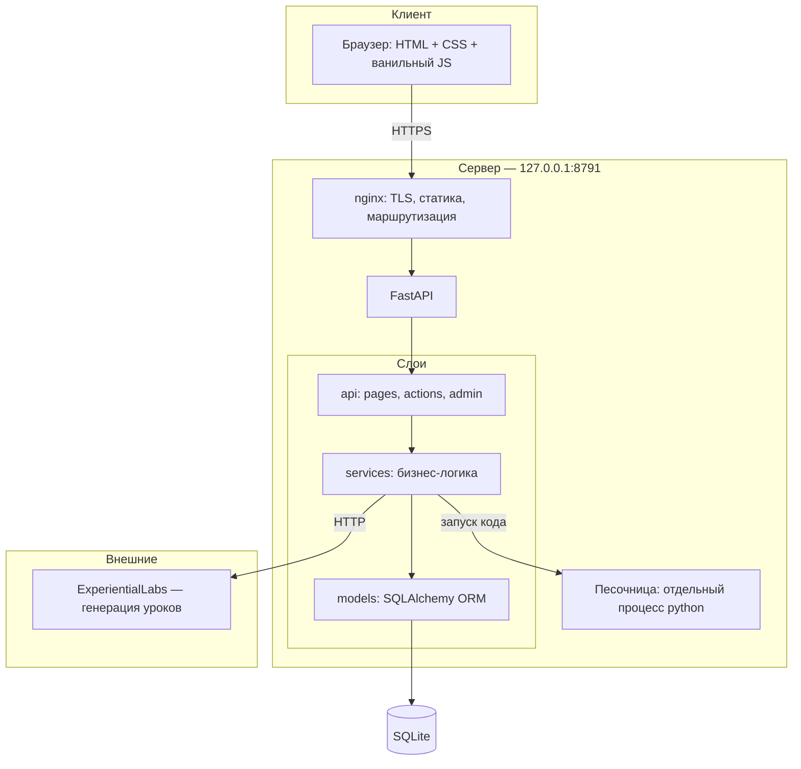
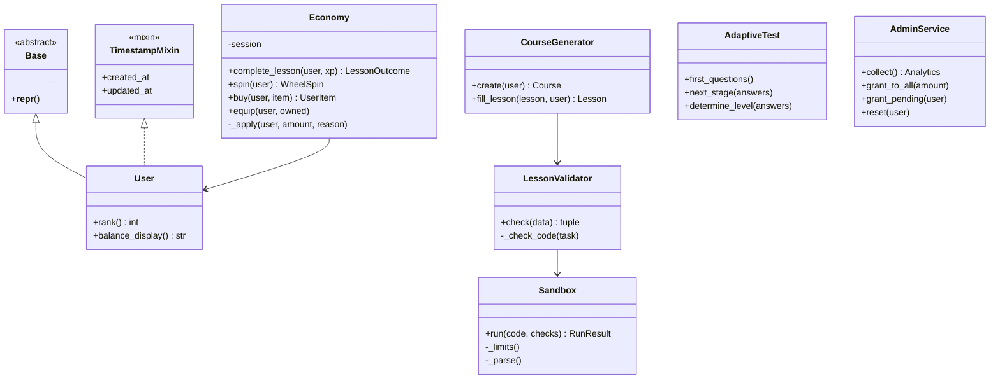
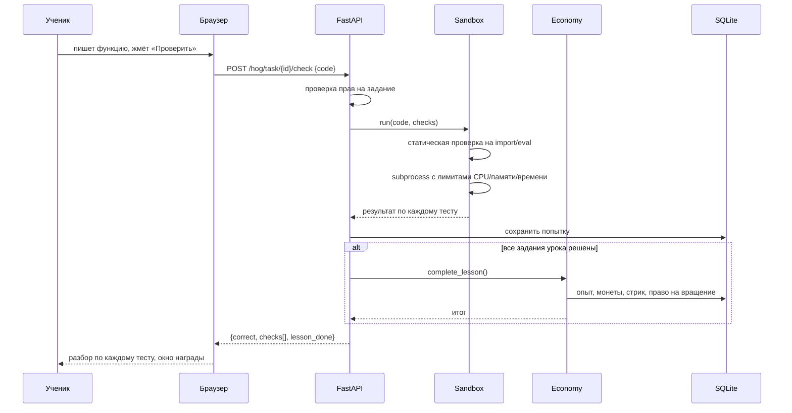

# 3. Архитектура

## Общая схема

## Слои и ответственность

| Слой | Пакет | За что отвечает | Чего не делает |
|---|---|---|---|
| Представление | `app/templates`, `app/static` | Вёрстка, анимации, обращения к API | Не хранит правильные ответы и не считает награды |
| HTTP | `app/api` | Разбор запроса, проверка прав, вызов сервисов | Не содержит бизнес-правил |
| Логика | `app/services` | Экономика, генерация курса, песочница, диагностика | Не знает про HTTP |
| Данные | `app/models` | Схема, связи, ограничения целостности | Не содержит логики начислений |

Разделение проверяется просто: `services` не импортирует `fastapi`, а `models` не импортирует `services`.

## Объектная модель

Проект построен на классах, а не на наборе функций. Ключевые:

**Наследование:** все модели наследуют `Base`, часть — подмешивает `TimestampMixin`.
**Инкапсуляция:** баланс меняется только через `Economy._apply`, напрямую поля никто не трогает.
**Полиморфизм:** тип задания (`TaskKind`) определяет способ проверки — код исполняется
в песочнице, остальные сверяются с эталоном; вызывающий код об этом различии не знает.

## Ключевой сценарий: проверка кода

## Почему такой стек

Методичка перечисляет React/Vue, ASP.NET Core + Entity Framework, PostgreSQL/MSSQL
и допускает расширение по согласованию. Выбран другой набор, и вот почему.

| Решение | Обоснование |
|---|---|
| **Python + FastAPI** | Приложение обучает Python и **исполняет** код учеников. На той же платформе это делается штатным `subprocess` с ресурсными лимитами. На .NET пришлось бы тащить отдельный Python-рантайм — лишний слой без выигрыша |
| **SQLAlchemy 2.0** | Полноценный ORM с типизированными `Mapped[...]`, декларативными моделями и связями — прямой аналог Entity Framework |
| **Ванильный JS без сборки** | Клиент — семь небольших скриптов. React потребовал бы Node, сборку и CI ради задачи, которую решают 500 строк. Меньше движущихся частей при развёртывании |
| **Jinja2 (server-side rendering)** | Первый экран должен открываться мгновенно: он же точка конверсии. SSR отдаёт готовый HTML за 0,48 с без ожидания JS-бандла |

> Методичка допускает расширение стека; выбор каждого инструмента обоснован в таблице выше.

### База данных

SQLite выбран сознательно, методичка допускает его «с объяснением необходимости».

**Почему подходит сейчас:** нагрузка учебного стенда — единицы одновременных пользователей;
запись включает WAL; вся база — один файл, что упрощает бэкап и перенос; развёртывание
не требует отдельного сервиса на машине с 2 ГБ памяти.

**Что сделано, чтобы миграция была дешёвой:** весь доступ идёт через SQLAlchemy ORM,
диалект меняется одной строкой `DATABASE_URL`. Сырых SQL-запросов в бизнес-логике нет
(единственное исключение — миграции схемы в `services/migrate.py`).

**Когда переезжать на PostgreSQL:** не «когда наберётся N регистраций», а по измеримому
признаку — когда в логах появятся ожидания блокировки записи (`database is locked`)
или время отклика на запись превысит 200 мс. См. [07-риски.md](07-риски.md).
