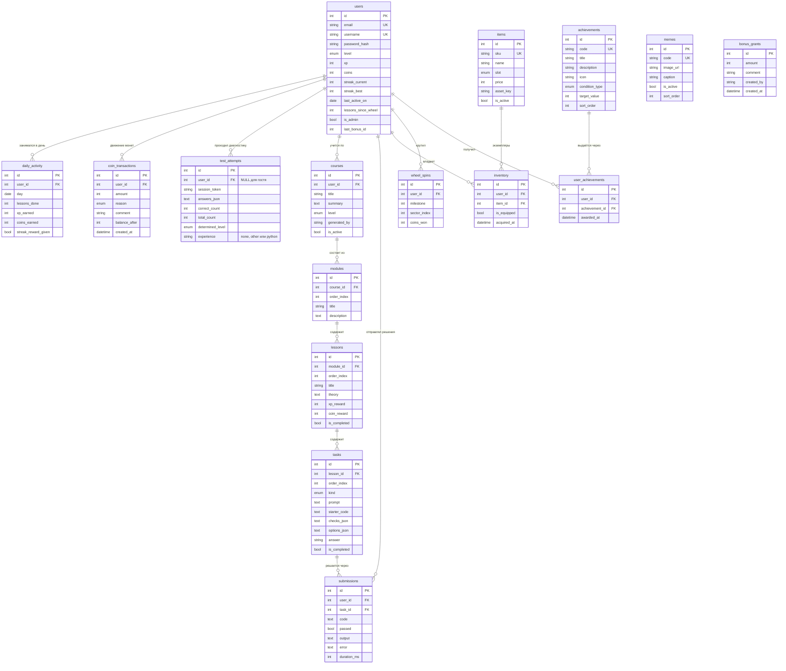

# 4. Модель данных

**16 сущностей**, из них **11 представляют объекты реального мира** (методичка требует
не менее 10 и не менее 7 соответственно).

## ERD

## Сущности

### Объекты реального мира (11)

| Сущность | Что моделирует |
|---|---|
| `users` | Человек, который учится |
| `test_attempts` | Прохождение диагностики — событие с ответами и итогом |
| `courses` | Учебный курс |
| `modules` | Раздел курса |
| `lessons` | Занятие |
| `tasks` | Задание |
| `submissions` | Попытка решения — что именно человек написал и что получилось |
| `items` | Предмет: одежда, скин, транспорт, дом |
| `wheel_spins` | Вращение колеса — событие с призом |
| `achievements` | Медаль: награда за поведение |
| `memes` | Картинка, которую показывают после урока |

### Служебные и связующие (5)

| Сущность | Назначение |
|---|---|
| `daily_activity` | День занятий: на нём держится трекер серий |
| `coin_transactions` | Журнал движения монет — источник истины по балансу |
| `inventory` | Связь «пользователь ↔ предмет», отношение многие-ко-многим |
| `bonus_grants` | Массовое начисление от администратора |
| `user_achievements` | Связь «пользователь ↔ медаль», многие-ко-многим |

> `bonus_grants` намеренно **не связана внешним ключом** с `users`: одна запись адресована
> сразу всем. Кто её уже получил, определяется сравнением `users.last_bonus_id` с `id` записи.
> Поэтому бонус доходит и до тех, кто был офлайн, и начисляется ровно один раз.

## Ограничения целостности

| Ограничение | Где | Зачем |
|---|---|---|
| `UNIQUE(email)`, `UNIQUE(username)` | `users` | Один аккаунт на почту и на имя |
| `UNIQUE(user_id, day)` | `daily_activity` | Один день — одна запись |
| `UNIQUE(user_id, item_id)` | `inventory` | Нельзя купить один предмет дважды |
| `UNIQUE(user_id, achievement_id)` | `user_achievements` | **Одна медаль — один раз.** Та же защита, что у колеса |
| `UNIQUE(user_id, milestone)` | `wheel_spins` | **Одна веха — один приз.** Двойной клик и параллельные вкладки не дают лишних монет |
| `UNIQUE(lesson_id, order_index)` | `tasks` | **Защита от задвоения заданий**, когда фоновая подготовка и запрос пользователя берутся за один урок одновременно |
| `CHECK(price >= 0)` | `items` | Отрицательная цена невозможна |
| `ON DELETE CASCADE` | все связи с `users` | Удаление аккаунта не оставляет мусора |

## Принятые решения

**Баланс — кеш, журнал — истина.** Поле `users.coins` существует ради скорости чтения,
но каждое изменение сопровождается записью в `coin_transactions` с полем `balance_after`.
Баланс всегда можно пересчитать суммой и сверить.

**Проверки заданий и правильные ответы не уходят клиенту.** `tasks.answer` и `checks_json`
читаются только на сервере; в HTML попадают лишь формулировка и варианты.

**Прогресс хранится в самих уроках.** Курс персональный, поэтому отдельная таблица
`user_lesson_progress` не нужна: `lessons.is_completed` относится к конкретному человеку.
При переходе к общему каталогу уроков её придётся завести — отмечено в [07-риски.md](07-риски.md).

**JSON в текстовых полях.** `checks_json`, `options_json`, `answers_json` хранятся строкой
и разбираются свойствами модели (`Task.проверки`, `Task.варианты`). Структура этих данных
меняется вместе с генератором, и выносить её в отдельные таблицы преждевременно.
