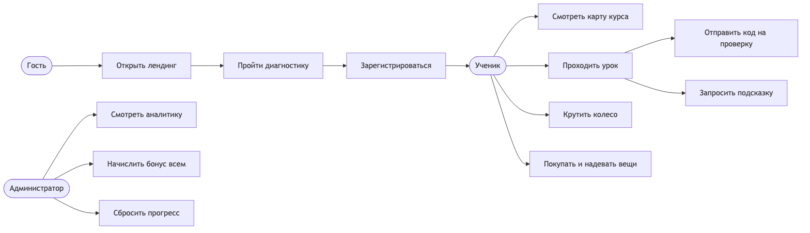
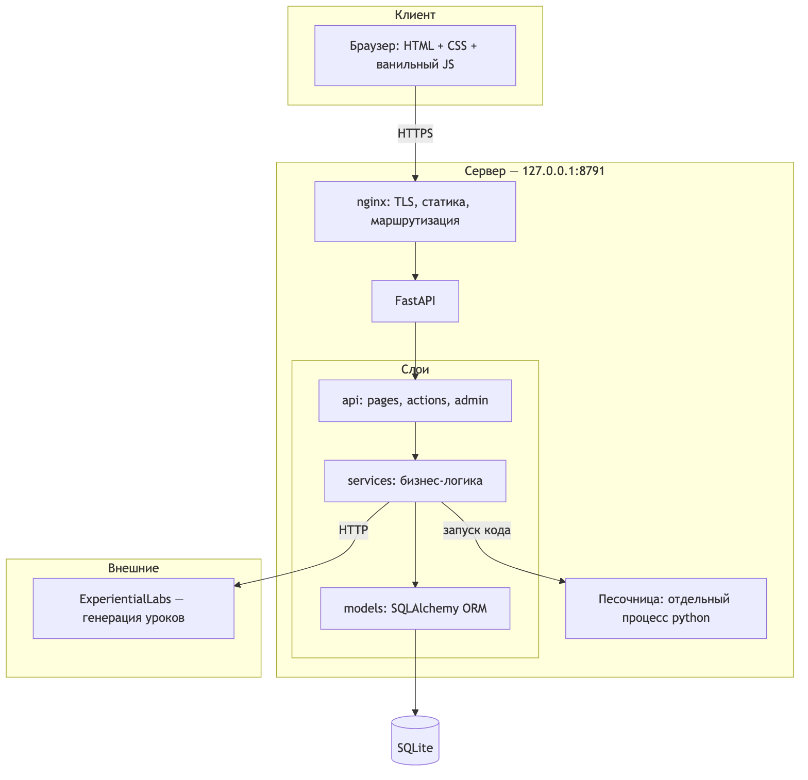
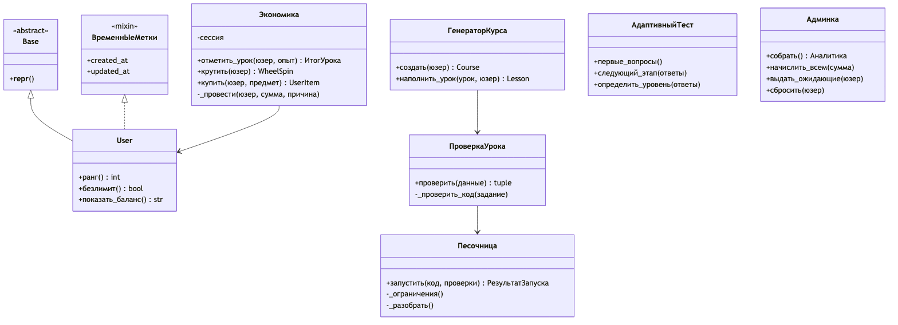
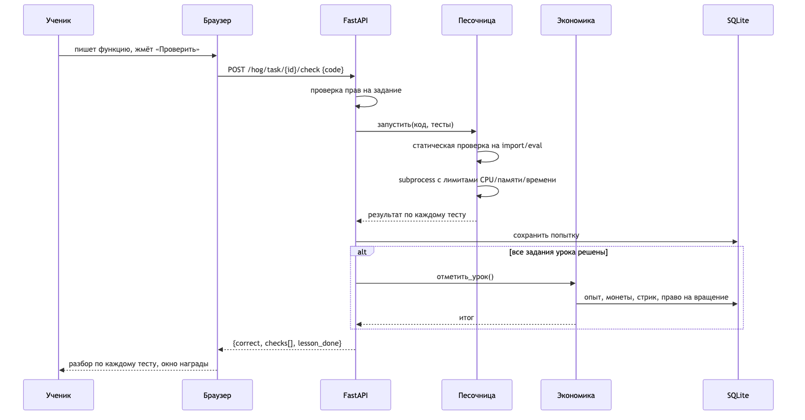
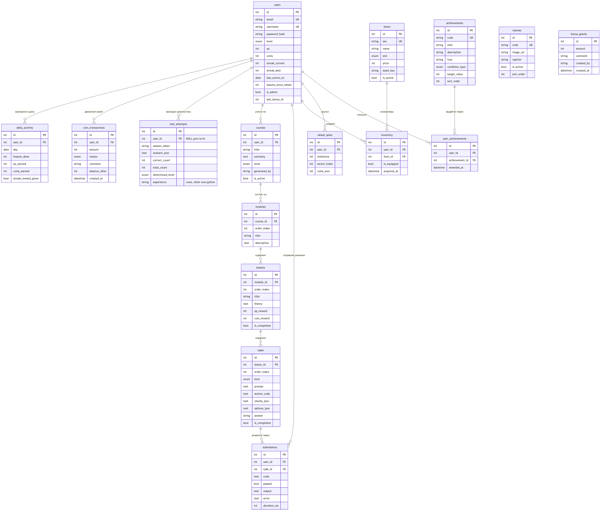

Клиент-серверное веб-приложение: игровой тренажёр программирования на Python.

**Рабочий стенд:** https://maks.my


\newpage

# 1. Контекст приложения

## Задача

Человек решает изучить Python и упирается в две проблемы.

Первая — **непонятно, с чего начинать**. Курсы либо предполагают нулевой уровень и утомляют
того, кто уже знает основы, либо начинают со среднего и теряют новичка на второй неделе.

Вторая — **не хватает причины возвращаться завтра**. Мотивация «надо выучить» держится
несколько дней. Дальше нужен внешний повод, и у обучающих продуктов его обычно нет.

CodeHogwarts решает обе: маршрут собирается после короткой диагностики, а возвращаться заставляет
игровой контур — монеты за практику, серии дней и персонаж, которого видно, как он растёт.

## Почему это не «ещё один курс»

| Обычный курс | CodeHogwarts |
|---|---|
| Один поток для всех | Маршрут по результату диагностики и найденным пробелам |
| Проверка по эталону строки | **Код запускается и прогоняется тестами** |
| Прогресс в процентах | Прогресс виден на персонаже: одежда, скин, транспорт, дом |
| Мотивация «надо» | Серия дней, монеты, колесо |

## Целевая аудитория

| Сегмент | Что ему нужно | Что получает |
|---|---|---|
| Полный новичок | Не испугаться и получить первый успех быстро | Первый урок открывается мгновенно, задания по 5 минут |
| Знает основы | Не тратить время на то, что уже умеет | Диагностика отправляет сразу в средний маршрут |
| Готовится к собеседованию | Точечно закрыть пробелы | Продвинутый маршрут: замыкания, генераторы, декораторы |

## Варианты использования




### Описание вариантов использования

| № | Актор | Вариант использования | Результат |
|---|---|---|---|
| UC-1 | Гость | Пройти диагностику | Определён уровень, найдены слабые темы |
| UC-2 | Гость | Зарегистрироваться | Создан аккаунт, собран персональный курс |
| UC-3 | Ученик | Пройти урок | Решены задания, начислены опыт и монеты |
| UC-4 | Ученик | Отправить код | Код исполнен в песочнице, показан результат по каждому тесту |
| UC-5 | Ученик | Запросить подсказку | Модель отвечает по коду ученика, не выдавая решение |
| UC-6 | Ученик | Крутить колесо | Начислены монеты, вращение списано |
| UC-7 | Ученик | Купить предмет | Списаны монеты, предмет надет, персонаж изменился |
| UC-8 | Ученик | Поддерживать серию | Ежедневный бонус, каждые 7 дней — дополнительный |
| UC-9 | Администратор | Смотреть аналитику | Воронка, этапы пользователей, экономика |
| UC-10 | Администратор | Начислить бонус всем | Монеты падают каждому при следующем входе |
| UC-11 | Администратор | Сбросить прогресс | Обнулён курс, монеты, инвентарь |

## Границы проекта

**Входит:** диагностика, генерация курса, исполнение кода, экономика, магазин, админ-панель,
три языка интерфейса.

**Не входит:** оплата реальными деньгами, мобильные приложения, соревнования между
пользователями, видеоуроки, сертификаты.


\newpage

# 2. Требования

## Функциональные требования

### Диагностика

| ID | Требование |
|---|---|
| FR-1 | Диагностика доступна без регистрации |
| FR-2 | Банк содержит задания трёх сложностей: простые, средние, сложные |
| FR-3 | Выдача адаптивная: сначала три средних, дальше ветвление по результату |
| FR-4 | Правильные ответы хранятся только на сервере и не попадают в HTML |
| FR-5 | По итогам определяется уровень и список слабых тем |
| FR-6 | Результат гостя привязывается к аккаунту при регистрации |

### Курс и уроки

| ID | Требование |
|---|---|
| FR-7 | Курс строится по каркасу тем, соответствующему определённому уровню |
| FR-8 | Содержание урока генерирует языковая модель |
| FR-9 | Сгенерированное проверяется: структура, типы заданий, наличие ответов |
| FR-10 | Для заданий на код эталонное решение **исполняется** и обязано пройти свои тесты |
| FR-11 | Не прошедший проверку урок заменяется проверенным шаблонным |
| FR-12 | Первый урок доступен мгновенно, последующие готовятся заранее в фоне |
| FR-13 | Типы заданий: предсказать вывод, выбрать вариант, написать код |
| FR-14 | Урок считается пройденным, когда решены все его задания |

### Исполнение кода

| ID | Требование |
|---|---|
| FR-15 | Код ученика исполняется в отдельном процессе |
| FR-16 | Результат сверяется с набором тестов, по каждому показывается ожидание и факт |
| FR-17 | Ошибка исполнения показывается человеку понятным текстом |
| FR-18 | Каждая попытка сохраняется в истории |

### Экономика и игра

| ID | Требование |
|---|---|
| FR-19 | Монеты начисляются за урок, день занятий и серию дней |
| FR-20 | Награда за уроки ограничена тремя в день |
| FR-21 | Пропуск дня сбрасывает серию, но не отнимает накопленное |
| FR-22 | Каждые 5 награждённых уроков дают вращение колеса |
| FR-23 | Приз колеса определяет сервер; повтор запроса не даёт новых монет |
| FR-24 | Предметы покупаются за монеты и меняют внешний вид персонажа |
| FR-25 | В одном слоте одновременно только один предмет |
| FR-26 | Баланс не может стать отрицательным |

### Администрирование

| ID | Требование |
|---|---|
| FR-27 | Панель доступна только администратору, для остальных её не существует (404) |
| FR-28 | Аналитика: пользователи, воронка, этапы, экономика |
| FR-29 | Массовое начисление бонуса; каждый получает ровно один раз |
| FR-30 | Сброс прогресса себе или любому пользователю |
| FR-31 | У администратора монеты не списываются |

### Интерфейс

| ID | Требование |
|---|---|
| FR-32 | Первый экран содержит одну целевую кнопку без отвлекающих элементов |
| FR-33 | Языки: русский (по умолчанию), английский, чеченский |
| FR-34 | Непереведённые строки показываются по-русски |
| FR-35 | Вёрстка работает на мобильном без горизонтальной прокрутки |

## Нефункциональные требования

| ID | Требование | Проверка |
|---|---|---|
| NFR-1 | Страница урока открывается менее чем за 1 с | Замер: **270 мс** |
| NFR-2 | Главная отвечает менее чем за 1 с | Замер: **0,48 с** |
| NFR-3 | Код ученика не может занять процесс дольше 5 с | Тест бесконечного цикла: обрыв на 5,0 с |
| NFR-4 | Код ученика не имеет доступа к файловой системе и сети | Тест `import os`: отклонён |
| NFR-5 | Пароли хранятся только в виде хеша | bcrypt |
| NFR-6 | Сессия подписана и не подделывается на клиенте | itsdangerous |
| NFR-7 | Приложение работает без ключа языковой модели | Курс собирается из шаблонов |
| NFR-8 | Одновременная генерация одного урока не приводит к дублям | Уникальный индекс + тест на 4 параллельных запроса |
| NFR-9 | Перезапуск сервиса не приводит к потере данных | SQLite на диске, systemd `Restart=always` |

## Негативные сценарии

| Сценарий | Ожидаемое поведение |
|---|---|
| Бесконечный цикл в коде ученика | Обрыв по таймауту, понятное сообщение |
| Попытка `import os` | Отклонение до запуска |
| Модель вернула не-JSON | Повтор, затем шаблонный урок |
| Модель вернула нерабочий эталон | Урок отбракован, берётся шаблонный |
| Шлюз модели недоступен | Курс работает на шаблонах |
| Покупка дороже баланса | Отказ с указанием, сколько не хватает |
| Двойной клик по колесу | Приз выдаётся один раз |
| Чужой урок по прямой ссылке | Переадресация на свой курс |
| Гость открывает `/admin` | 404 |


\newpage

# 3. Архитектура

## Общая схема




## Слои и ответственность

| Слой | Пакет | За что отвечает | Чего не делает |
|---|---|---|---|
| Представление | `app/templates`, `app/static` | Вёрстка, анимации, обращения к API | Не хранит правильные ответы и не считает награды |
| HTTP | `app/api` | Разбор запроса, проверка прав, вызов сервисов | Не содержит бизнес-правил |
| Логика | `app/services` | Экономика, генерация курса, песочница, диагностика | Не знает про HTTP |
| Данные | `app/models` | Схема, связи, ограничения целостности | Не содержит логики начислений |

Разделение проверяется просто: `services` не импортирует `fastapi`, а `models` не импортирует `services`.

## Объектная модель

Проект построен на классах, а не на наборе функций. Ключевые:




**Наследование:** все модели наследуют `Base`, часть — подмешивает `ВременнЫеМетки`.
**Инкапсуляция:** баланс меняется только через `Экономика._провести`, напрямую поля никто не трогает.
**Полиморфизм:** тип задания (`ТипЗадания`) определяет способ проверки — код исполняется
в песочнице, остальные сверяются с эталоном; вызывающий код об этом различии не знает.

## Ключевой сценарий: проверка кода




## Почему такой стек

Методичка перечисляет React/Vue, ASP.NET Core + Entity Framework, PostgreSQL/MSSQL
и допускает расширение по согласованию. Выбран другой набор, и вот почему.

| Решение | Обоснование |
|---|---|
| **Python + FastAPI** | Приложение обучает Python и **исполняет** код учеников. На той же платформе это делается штатным `subprocess` с ресурсными лимитами. На .NET пришлось бы тащить отдельный Python-рантайм — лишний слой без выигрыша |
| **SQLAlchemy 2.0** | Полноценный ORM с типизированными `Mapped[...]`, декларативными моделями и связями — прямой аналог Entity Framework |
| **Ванильный JS без сборки** | Клиент — четыре небольших скрипта. React потребовал бы Node, сборку и CI ради задачи, которую решают 1000 строк. Меньше движущихся частей при развёртывании |
| **Jinja2 (server-side rendering)** | Первый экран должен открываться мгновенно: он же точка конверсии. SSR отдаёт готовый HTML за 0,48 с без ожидания JS-бандла |

> **Это отступление от списка в методичке и требует явного согласования с преподавателем.**

### База данных

SQLite выбран сознательно, методичка допускает его «с объяснением необходимости».

**Почему подходит сейчас:** нагрузка учебного стенда — единицы одновременных пользователей;
запись включает WAL; вся база — один файл, что упрощает бэкап и перенос; развёртывание
не требует отдельного сервиса на машине с 2 ГБ памяти.

**Что сделано, чтобы миграция была дешёвой:** весь доступ идёт через SQLAlchemy ORM,
диалект меняется одной строкой `DATABASE_URL`. Сырых SQL-запросов в бизнес-логике нет
(единственное исключение — миграции схемы в `services/migrate.py`).

**Когда переезжать на PostgreSQL:** не «когда наберётся N регистраций», а по измеримому
признаку — когда в логах появятся ожидания блокировки записи (`database is locked`)
или время отклика на запись превысит 200 мс. См. 07-риски.md.


\newpage

# 4. Модель данных

**16 сущностей**, из них **11 представляют объекты реального мира** (методичка требует
не менее 10 и не менее 7 соответственно).

## ERD




## Сущности

### Объекты реального мира (11)

| Сущность | Что моделирует |
|---|---|
| `users` | Человек, который учится |
| `test_attempts` | Прохождение диагностики — событие с ответами и итогом |
| `courses` | Учебный курс |
| `modules` | Раздел курса |
| `lessons` | Занятие |
| `tasks` | Задание |
| `submissions` | Попытка решения — что именно человек написал и что получилось |
| `items` | Предмет: одежда, скин, транспорт, дом |
| `wheel_spins` | Вращение колеса — событие с призом |
| `achievements` | Медаль: награда за поведение |
| `memes` | Картинка, которую показывают после урока |

### Служебные и связующие (5)

| Сущность | Назначение |
|---|---|
| `daily_activity` | День занятий: на нём держится трекер серий |
| `coin_transactions` | Журнал движения монет — источник истины по балансу |
| `inventory` | Связь «пользователь ↔ предмет», отношение многие-ко-многим |
| `bonus_grants` | Массовое начисление от администратора |
| `user_achievements` | Связь «пользователь ↔ медаль», многие-ко-многим |

> `bonus_grants` намеренно **не связана внешним ключом** с `users`: одна запись адресована
> сразу всем. Кто её уже получил, определяется сравнением `users.last_bonus_id` с `id` записи.
> Поэтому бонус доходит и до тех, кто был офлайн, и начисляется ровно один раз.

## Ограничения целостности

| Ограничение | Где | Зачем |
|---|---|---|
| `UNIQUE(email)`, `UNIQUE(username)` | `users` | Один аккаунт на почту и на имя |
| `UNIQUE(user_id, day)` | `daily_activity` | Один день — одна запись |
| `UNIQUE(user_id, item_id)` | `inventory` | Нельзя купить один предмет дважды |
| `UNIQUE(user_id, achievement_id)` | `user_achievements` | **Одна медаль — один раз.** Та же защита, что у колеса |
| `UNIQUE(user_id, milestone)` | `wheel_spins` | **Одна веха — один приз.** Двойной клик и параллельные вкладки не дают лишних монет |
| `UNIQUE(lesson_id, order_index)` | `tasks` | **Защита от задвоения заданий**, когда фоновая подготовка и запрос пользователя берутся за один урок одновременно |
| `CHECK(price >= 0)` | `items` | Отрицательная цена невозможна |
| `ON DELETE CASCADE` | все связи с `users` | Удаление аккаунта не оставляет мусора |

## Принятые решения

**Баланс — кеш, журнал — истина.** Поле `users.coins` существует ради скорости чтения,
но каждое изменение сопровождается записью в `coin_transactions` с полем `balance_after`.
Баланс всегда можно пересчитать суммой и сверить.

**Проверки заданий и правильные ответы не уходят клиенту.** `tasks.answer` и `checks_json`
читаются только на сервере; в HTML попадают лишь формулировка и варианты.

**Прогресс хранится в самих уроках.** Курс персональный, поэтому отдельная таблица
`user_lesson_progress` не нужна: `lessons.is_completed` относится к конкретному человеку.
При переходе к общему каталогу уроков её придётся завести — отмечено в 07-риски.md.

**JSON в текстовых полях.** `checks_json`, `options_json`, `answers_json` хранятся строкой
и разбираются свойствами модели (`Task.проверки`, `Task.варианты`). Структура этих данных
меняется вместе с генератором, и выносить её в отдельные таблицы преждевременно.


\newpage

# 5. Контракты API

Базовый адрес: `https://maks.my`
Интерактивная документация: `/hog/docs` (генерируется FastAPI автоматически).

> **Почему префикс `/hog`, а не `/api`.** На сервере `maks.my` путь `/api/` уже занят
> другим приложением на порту 8787. Совпадение префиксов перехватило бы чужие запросы,
> поэтому свои эндпоинты вынесены под `/hog/`.

## Аутентификация

Сессия — подписанная cookie `codehog_session` (`itsdangerous`, HttpOnly, SameSite=Lax,
30 дней). Подделать на клиенте нельзя: подпись проверяется секретом из `SECRET_KEY`.

Гостевая сессия — cookie `codehog_guest`, живёт сутки. Нужна, чтобы связать результат
диагностики, пройденной до регистрации, с созданным потом аккаунтом.

## Страницы

| Метод | Путь | Доступ | Назначение |
|---|---|---|---|
| GET | `/` | все | Лендинг; вошедшего перенаправляет на `/app` |
| GET | `/test` | все | Диагностика |
| GET | `/register` | все | Регистрация, уровень подставляется из диагностики |
| POST | `/register` | все | Создаёт аккаунт и курс, запускает фоновую подготовку уроков |
| GET/POST | `/login` | все | Вход **по почте или логину** |
| GET | `/logout` | все | Выход |
| GET | `/lang/{code}` | все | Переключение языка: `ru`, `en`, `ce` |
| GET | `/app` | ученик | Карта курса, персонаж, колесо |
| GET | `/lesson/{id}` | ученик | Урок; чужой урок → редирект на `/app` |
| GET | `/shop` | ученик | Магазин |
| GET | `/admin` | админ | Панель; гость → на вход, не-админ → 404 |
| GET | `/health` | все | Состояние сервиса |

## JSON-эндпоинты

### Диагностика

**`POST /hog/test/submit`**

```json
{ "answers": [ { "id": "M1", "answer": "[0, 4, 16]" } ] }
```

Ответ, пока тест не окончен:

```json
{ "done": false, "questions": [ { "id": "H1", "difficulty": "hard",
  "topic": "аргументы по умолчанию", "text": "...", "code": "...",
  "options": ["..."] } ], "progress": 3 }
```

Ответ по завершении:

```json
{ "done": true, "level": "advanced", "level_label": "Продвинутый",
  "correct": 5, "total": 6, "weak_topics": ["генераторы"],
  "explanations": [ { "id": "H3", "correct": false, "text": "..." } ] }
```

> Правильные ответы клиенту не отправляются: сверка идёт на сервере по `id` вопроса.

### Проверка задания

**`POST /hog/task/{task_id}/check`**

```json
{ "code": "def solve(numbers):\n    return sum(n for n in numbers if n % 2 == 0)" }
```

Для заданий без кода вместо `code` передаётся `answer`.

```json
{ "correct": true, "output": "", "error": "",
  "checks": [ { "call": "solve([1, 2, 3, 4])", "expected": 6, "got": 6,
                "passed": true, "error": "" } ],
  "explanation": "...", "hint": "...",
  "lesson_done": { "coins": 25, "xp": 20, "streak": 1, "spins": 0, "capped": false } }
```

`lesson_done` приходит только в тот момент, когда решено последнее задание урока.

| Код | Когда |
|---|---|
| 200 | Проверка выполнена (в том числе если ответ неверный) |
| 401 | Не выполнен вход |
| 404 | Задание не существует или принадлежит другому пользователю |

### Подсказка

**`POST /hog/task/{task_id}/hint`** — `{ "code": "..." }`

```json
{ "hint": "Обратите внимание на условие чётности...", "source": "deepseek-v4-flash" }
```

Без ключа модели возвращается статичная подсказка из задания, `source: "static"`.
Модель проинструктирована не выдавать готовое решение.

### Колесо

**`GET /hog/wheel/state`**

```json
{ "spins": 2, "coins": 275,
  "sectors": [ {"coins": 10, "weight": 45}, {"coins": 20, "weight": 30},
               {"coins": 40, "weight": 18}, {"coins": 80, "weight": 6},
               {"coins": 150, "weight": 1} ] }
```

**`POST /hog/wheel/spin`**

```json
{ "sector": 2, "coins_won": 40, "coins": 315, "spins_left": 1 }
```

| Код | Когда |
|---|---|
| 200 | Приз выдан |
| 400 | Вращений нет: «Вращений пока нет — пройдите ещё уроки» |
| 401 | Не выполнен вход |

Приз определяется на сервере до анимации. Повторный запрос за ту же веху вернёт
прежний результат и не начислит монеты повторно.

### Магазин

**`POST /hog/shop/buy/{sku}`**

```json
{ "ok": true, "coins": 235, "equipped": true, "slot": "head", "asset": "cap" }
```

**`POST /hog/shop/equip/{sku}`** — переключает «надето / снято».

| Код | Когда |
|---|---|
| 200 | Куплено или переключено |
| 400 | «Не хватает N монет» |
| 404 | Предмета нет в каталоге или он не куплен |

## Админские действия

Все требуют роли администратора; форма отправляется как `application/x-www-form-urlencoded`.

| Метод | Путь | Действие |
|---|---|---|
| POST | `/admin/bonus` | `amount`, `comment` — начислить всем |
| POST | `/admin/reset` | Сбросить собственный прогресс |
| POST | `/admin/reset/{user_id}` | Сбросить указанного пользователя |
| POST | `/admin/unlock` | Выдать себе весь каталог предметов |
| POST | `/admin/complete` | Отметить весь курс пройденным |

## Общие правила ошибок

Ошибки возвращаются как `{"detail": "текст на русском"}` с осмысленным HTTP-кодом.
Тексты предназначены для показа человеку, стек-трейсы наружу не отдаются.


\newpage

# 6. Команда, роли и план работ

## Роли

Команда из пяти человек. Методичка требует, чтобы на защите была видна работа
каждого, поэтому у каждой роли указан артефакт, по которому вклад проверяется.

| Участник | Роли | Зона ответственности | Чем подтверждается |
|---|---|---|---|
| Кристина | **Project Manager**, Бизнес-аналитик | План работ, Kanban-доска, дорожная карта | Коммиты в репозиторий документации, доска YouGile |
| Вика | **Lead BA**, **UX/UI-дизайнер** | Бизнес-требования, макеты интерфейса | Коммиты в документацию, проект Figma |
| Лена | **Тимлид**, Системный аналитик | Выбор стека, регламент GitFlow, контракты REST API, ревью | Ревью Pull Request, разделы 05 и 09 |
| Олимпиада | **Lead System Analyst** | ERD, декомпозиция требований, тест-кейсы | Разделы 02 и 04, набор тест-кейсов |
| Максим | **Fullstack-разработчик**, **Database engineer**, **DevOps** | Сервер, клиент, схема БД, интеграция с ИИ, развёртывание | Коммиты в репозиторий приложения, работающий стенд |

### Справочник ролей из методички

| Роль | Чем занимается | Как отчитывается |
|---|---|---|
| Backend | API, серверная логика | Коммиты в репозиторий бэкенда |
| Frontend | Веб-интерфейс | Коммиты в репозиторий фронтенда |
| Database engineer | Проектирование БД | Коммиты в репозиторий бэкенда |
| DevOps | Развёртывание | Коммиты в оба репозитория |
| Системный аналитик | Требования бизнеса → требования к ПО | Коммиты в документацию |
| Бизнес-аналитик | Бизнес-требования, визионерство | Коммиты в документацию |
| Тимлид | Декомпозиция, делегирование, ревью | Коммиты в документацию |
| Project Manager | План работ, Kanban-доска | Коммиты в документацию |
| UX/UI+Дизайнер | Дизайн интерфейса | Ссылка на Figma в README документации |

## Репозитории

Методичка предлагает раздельные репозитории. Проект пока в одном — это осознанный выбор
для команды такого размера, но при защите его нужно уметь обосновать.

| Репозиторий | Содержимое | Статус |
|---|---|---|
| `codehog` | Приложение целиком: `app/`, `deploy/` | ✅ есть |
| `SmartSchool-Docs` | Проектная документация | ✅ создан, владелец Кристина |
| Figma-проект | Макеты интерфейса | ⬜ **не создан** — ссылку нужно добавить в README |
| Доска YouGile | Задачи и спринты | ✅ создана |

## График работ

| Этап | Содержание | Статус |
|---|---|---|
| **Анализ** | Тема, юзкейсы, бизнес-требования | ✅ 01, 02 |
| **Проектирование** | ERD, архитектура, контракты API | ✅ 03, 04, 05 |
| **Каркас** | Модели, база, «Hello World» приложения | ✅ 13 таблиц, приложение поднимается |
| **Ядро** | Диагностика, курс, песочница, экономика | ✅ работает |
| **Интерфейс** | Лендинг, тест, урок, магазин, панель | ✅ работает |
| **Развёртывание** | nginx, systemd, HTTPS | ✅ https://maks.my |
| **Тестирование** | Автотесты вместо ручной проверки | ⬜ **не сделано** |
| **Дизайн** | Figma-макеты | ⬜ **не сделано** |

## Соответствие чекпоинтам методички

### 2 лабораторная

| Требование | Статус |
|---|---|
| Качество GitHub-проекта, репозиториев, веток | ✅ два репозитория, ветки `main` и `develop`, регламент в разделе 9 |
| Анализ задачи и первичный дизайн | ✅ |
| Принципиальная ERD-диаграмма | ✅ 04-модель-данных.md |
| «Hello World»-проекты в рамках задачи | ✅ приложение работает целиком |
| График работ + Roadmap | ✅ этот документ |
| Определены контракты | ✅ 05-api.md |
| Завершён анализ бизнес-требований | ✅ 02-требования.md |

### 3 лабораторная

| Требование | Статус |
|---|---|
| Приложение по графику работ | ✅ |
| Первый смотр работы приложения | ✅ стенд доступен |
| Проверка и ревью кодовой базы | ✅ код готов к ревью |
| Проверка документации | ✅ этот комплект |
| Покрыты все положительные кейсы | ✅ UC-1…UC-11 работают |
| Завершён дизайн | ⚠️ интерфейс готов, **Figma-макетов нет** |

## Roadmap развития

| Горизонт | Что | Зачем |
|---|---|---|
| Ближайший | Автотесты на экономику и песочницу | Сейчас проверки ручные, регрессии ловятся глазами |
| Ближайший | Согласовать стек с преподавателем письменно | Без этого отступление от методички — риск для оценки |
| Ближайший | Figma-макеты | Прямое требование методички |
| Средний | Расширить банк диагностики до 15 заданий на сложность | Девять заданий запоминаются, уровень определяется неточно |
| Средний | Кнопка «в задании ошибка» | Модель ошибается, нужен канал обратной связи |
| Средний | Исполнение кода в контейнере без сети | Текущая изоляция — процессная, для публичного сервиса мало |
| Дальний | PostgreSQL | При появлении ожиданий блокировки записи |
| Дальний | Общий каталог уроков + `user_lesson_progress` | Сейчас уроки персональные, исправлять ошибки в контенте дорого |

## Что честно не сделано

1. **Автотестов нет.** Всё проверялось вручную и скриптами: песочница на шести сценариях,
   экономика симуляцией месяца, гонка — четырьмя параллельными запросами. Результаты
   воспроизводимы, но это не заменяет `pytest`.
2. **Нет Figma.** Дизайн сделан сразу в CSS, макетов в Figma не существует.
3. **Чеченская локализация не проверена носителем.**
4. **Стек не согласован с преподавателем письменно.** Проект написан не на
   ASP.NET Core, и это отступление от списка по умолчанию требует явного
   согласования. См. раздел 9.
5. **Название проекта расходится между репозиториями.** В документации
   «CodeHogwarts», в коде и на домене «CodeHogwarts».


\newpage

# 7. Риски, негативные кейсы и подводные камни

Методичка обещает вопросы про негативные кейсы, расширяемость и «подводные камни».
Здесь собрано то, что реально всплыло при разработке, а не гипотетический список.

## Подводные камни, найденные в работе

### 1. Кириллица в идентификаторах ломает инструменты

Код написан по-русски — это читаемо, но трижды привело к отказам.

| Где | Что произошло | Решение |
|---|---|---|
| Bash-скрипты | `bash 3.2` в macOS не поддерживает кириллицу в именах переменных: `command not found` | Имена переменных латиницей |
| `jq` | `.[0].файл` — синтаксическая ошибка, кириллический ключ нужно брать в кавычки | Ключи JSON латиницей |
| **Маршруты FastAPI** | `@роутер.get("/lang/{код}")` — маршрут **не сопоставляется**, всегда 404 | Параметры пути латиницей |

**Вывод:** имена, попадающие во внешние инструменты (пути URL, ключи JSON, переменные
окружения), должны быть латиницей. Внутренние имена классов и методов — по вкусу.

Отдельно: `bash -n` проверяет только разбор и **не ловит** падения на присваиваниях.
Скрипты нужно проверять запуском.

### 2. Гонка при генерации урока

Фоновая подготовка и запрос пользователя брались за один урок одновременно —
в базе оказалось **6 заданий вместо 3**.

**Решение:** уникальный индекс `(lesson_id, order_index)` плюс перезапрос состояния
перед записью и обработка `IntegrityError`. Проверено четырьмя параллельными запросами
в один урок: пять параллельных попыток отброшено, дублей ноль.

**Урок:** идемпотентность «проверил и записал» на уровне кода недостаточна, когда
процессов несколько. Гарантию даёт только ограничение в базе.

### 3. Гонка воркеров при старте

Два воркера uvicorn одновременно создавали таблицы, один падал с
`Application startup failed`. **Решение:** файловая блокировка вокруг инициализации.
Проверено четырьмя перезапусками: восемь успешных стартов, ноль падений.

### 4. Генерация на критическом пути

Первое открытие урока занимало **21,8 секунды** — модель генерировала его прямо в запросе.

**Решение:** первый урок отдаётся мгновенно из проверенного шаблона, следующие готовятся
в фоне, пока человек занимается текущим. Стало **270 мс**.

### 5. Модель врёт, и это нормально

`deepseek-v4-flash` вернула эталонное решение с JSON-литералом `true` внутри Python-кода —
код не запускается. Поймано **автоматически**: эталон прогоняется в песочнице и обязан
пройти собственные тесты. Урок отбракован, человек получил шаблонный.

**Вывод:** самопроверка модели ничего не гарантирует. Единственная надёжная проверка
сгенерированного кода — исполнить его.

### 6. Столкновение префиксов при развёртывании

На `maks.my` путь `/api/` уже занят другим приложением. Наш API перехватил бы чужие
запросы. **Решение:** префикс `/hog/`.

**Вывод:** при развёртывании на общий домен префикс — часть контракта, а не деталь.

## Негативные кейсы и поведение системы

| Кейс | Поведение | Проверено |
|---|---|---|
| Бесконечный цикл в коде | Обрыв на 5 с, понятное сообщение | ✅ |
| `import os`, `eval`, `open` | Отклонение до запуска | ✅ |
| Синтаксическая ошибка | Текст ошибки с номером строки | ✅ |
| Переполнение памяти | Лимит 128 МБ, сообщение вместо падения сервиса | ✅ |
| Модель недоступна | Шаблонный урок, человек не замечает | ✅ |
| Модель вернула не-JSON | Повтор, затем шаблон | ✅ |
| Эталон не проходит свои тесты | Урок отбракован | ✅ в проде |
| Покупка дороже баланса | Отказ с суммой нехватки | ✅ |
| Двойной клик по колесу | Приз один | ✅ два параллельных запроса |
| Чужой урок по прямой ссылке | Редирект на свой курс | ✅ |
| Гость на `/admin` | Редирект на вход | ✅ |
| Вошедший не-админ на `/admin` | 404 — панели для него не существует | ✅ |
| Перезапуск сервиса | Данные на месте, автоподъём | ✅ |

## Расширяемость и масштабируемость

### Что упрётся первым

| Узкое место | Признак | Что делать |
|---|---|---|
| **SQLite на запись** | `database is locked` в логах, запись дольше 200 мс | PostgreSQL: меняется `DATABASE_URL`, ORM тот же |
| **Песочница в том же процессе** | Рост времени отклика при нескольких одновременных проверках | Вынести в отдельный воркер с очередью |
| **Генерация уроков** | Задержки и стоимость при росте пользователей | Кешировать уроки по паре «тема + уровень», а не генерировать каждому |
| **Персональные копии уроков** | Ошибку в контенте нельзя исправить у всех сразу | Общий каталог + таблица `user_lesson_progress` |
| **Память 2 ГБ** | Два воркера по 700 МБ + nginx + соседние сервисы | Ограничение `MemoryMax=700M` уже стоит |

### Что расширяется дёшево

- **Новый тип задания** — добавить значение в `ТипЗадания` и ветку проверки.
- **Новый язык** — словарь в `services/i18n.py`, непереведённое остаётся по-русски.
- **Новые предметы** — строка в каталоге `services/seed.py` и слой в SVG персонажа.
- **Новая тема курса** — запись в каркасе `services/curriculum.py`.
- **Смена модели** — переменная `COURSE_MODEL`, шлюз OpenAI-совместимый.

## Безопасность: честная оценка

| Что закрыто | Чем |
|---|---|
| Пароли | bcrypt, хеш в базе |
| Сессия | Подписанная cookie, HttpOnly, SameSite=Lax |
| Правильные ответы | Не попадают в HTML |
| Приз колеса | Определяется сервером |
| Доступ к чужим данным | Проверка владельца на каждом эндпоинте |
| Панель админа | Скрыта 404 от не-админов |

**Главный незакрытый риск — исполнение чужого кода.** Сейчас это отдельный процесс
с лимитами CPU, памяти, числа процессов и размера файлов, запрет опасных импортов,
пустой рабочий каталог. Для учебного стенда достаточно.

**Для публичного сервиса недостаточно:** нет сетевой изоляции (процесс технически может
открыть сокет, если обойти статическую проверку) и нет защиты от исчерпания ресурсов
десятками одновременных запусков. Правильное решение — контейнер без сети с квотами,
это отмечено в Roadmap.

## Главный продуктовый риск

Ощущение «я кликаю, но программировать не научился». Косметика возвращает человека
на несколько дней, но не заменяет рост навыка.

**Что мерить:** долю самостоятельно решённых задач без подсказок, возврат в течение
7 дней после первого пропуска, число подтверждённых ошибок в контенте на 1000 попыток.


\newpage

# 8. Развёртывание

## Стенд

| Параметр | Значение |
|---|---|
| Адрес | https://maks.my |
| Сервер | Ubuntu 24.04, 2 ГБ RAM, 30 ГБ диск |
| Приложение | `/opt/codehog`, systemd `codehog.service` |
| Порт | `127.0.0.1:8791` — наружу только через nginx |
| Пользователь | `www-data` |
| TLS | Let's Encrypt |

## Локальный запуск

```bash
cd codehog
cp .env.example .env        # вписать EXPLABS_API_KEY и ADMIN_PASSWORD
bash run.sh                 # http://127.0.0.1:8000
```

Без `EXPLABS_API_KEY` приложение работает полностью — курс собирается из шаблонов.

## Переменные окружения

| Переменная | Назначение |
|---|---|
| `EXPLABS_API_KEY` | Ключ шлюза для генерации уроков и подсказок |
| `COURSE_MODEL` | Модель по умолчанию (`deepseek-v4-flash`) |
| `COURSE_MODEL_FALLBACK` | Запасная модель |
| `ADMIN_PASSWORD` | Пароль администратора (логин всегда `maks-admin`) |
| `SECRET_KEY` | Секрет подписи сессий — в проде обязательно свой |
| `DATABASE_URL` | Путь к базе |

## Что добавлено на сервер

| Файл | Назначение |
|---|---|
| `/opt/codehog/` | Приложение и виртуальное окружение |
| `/etc/systemd/system/codehog.service` | Сервис |
| `/etc/nginx/snippets/codehog.location` | Маршрутизация главной |

В `/etc/nginx/sites-available/maks-ai-agents.conf` изменён **только** блок `location /`.
Соседние сервисы (`/kedr/`, `/idealsteklo/`, `/diving/`, `/dive-new/`, `/domaizkedra/`,
`/dji-agro/`, `/api/` платформы) не затронуты — коды ответов сверены до и после.

## Изоляция сервиса

Приложение исполняет чужой код, поэтому systemd-юнит ужат:

```
NoNewPrivileges=true      PrivateTmp=true
ProtectSystem=strict      ProtectHome=true
ReadWritePaths=/opt/codehog/data
LimitNPROC=256            MemoryMax=700M
```

Запись разрешена только в каталог с базой.

## Обновление

```bash
rsync -az --exclude '.venv' --exclude 'data' --exclude '.env' ./ root@maks.my:/opt/codehog/
ssh root@maks.my 'chown -R www-data:www-data /opt/codehog && systemctl restart codehog'
```

Миграции схемы применяются автоматически при старте (`services/migrate.py`).

## Откат

```bash
cp /etc/nginx/sites-available/maks-ai-agents.conf.bak-codehog-* \
   /etc/nginx/sites-available/maks-ai-agents.conf
nginx -t && systemctl reload nginx
systemctl stop codehog && systemctl disable codehog
```

Прежняя главная страница остаётся доступной по `/domaizkedra/` и после отката вернётся на `/`.

## Проверка после развёртывания

```bash
curl -s https://maks.my/health                  # {"status":"ok","ai":true}
systemctl is-active codehog                     # active
journalctl -u codehog -n 30 --no-pager
```

Плюс сверка соседних разделов — все должны отвечать 200:

```bash
for p in /kedr/ /idealsteklo/ /diving/ /dive-new/ /domaizkedra/ /dji-agro/; do
  echo "$p $(curl -s -o /dev/null -w '%{http_code}' https://maks.my$p)"
done
```


\newpage

# 9. Технологический стек, структура репозитория и регламент Git

Раздел закрывает требование методички по 2 лабораторной: «качество GitHub-проекта,
репозиториев, веток». Обоснование выбора стека по существу — в
03-архитектура.md, здесь стек **фиксируется**
как решение команды.

---

## 9.1 Фиксация технологического стека

> ⚠️ **Проект написан не на C# и не на ASP.NET Core.**
> В методичке C# ASP.NET Core, Entity Framework и PostgreSQL/MSSQL перечислены как стек
> по умолчанию. Рабочее приложение на https://maks.my написано на Python. Указывать
> в документации C# нельзя: документация разойдётся с кодом и со стендом, и это вскроется
> на первом же ревью кодовой базы.

| Слой | Что используется | Прямой аналог из списка методички |
|---|---|---|
| Бэкенд | **Python 3.14 + FastAPI** | ASP.NET Core |
| ORM | **SQLAlchemy 2.0** (типизированные `Mapped[...]`) | Entity Framework |
| База данных | **SQLite** (файл, режим WAL) | PostgreSQL / MSSQL |
| Шаблоны | **Jinja2**, server-side rendering | Razor Pages / Blazor |
| Клиент | **Ванильный JavaScript + HTML + CSS**, без сборки | React / Vue |
| Аутентификация | **bcrypt** + подписанные cookie (`itsdangerous`) | ASP.NET Identity |
| Исполнение кода учеников | **`subprocess`** с лимитами ресурсов | нет аналога |
| Развёртывание | **systemd + nginx** на собственном сервере | IIS / Azure |

**Фронтенд на JavaScript/HTML/CSS — здесь расхождения с методичкой нет.** Клиент
действительно на ванильном JS, пять файлов, 289 строк, без Node и без сборки.
Расхождение только по двум пунктам: язык бэкенда и СУБД.

### Почему так, коротко для защиты

Приложение учит Python и **исполняет код учеников**. На той же платформе это делается
штатным `subprocess` с ресурсными лимитами. На .NET пришлось бы тащить отдельный
Python-рантайм внутрь контейнера — лишний слой без единого выигрыша.

### Что требуется от команды

Методичка допускает расширение стека **по согласованию с преподавателем**. Согласование
нужно получить **до** чекпоинта и зафиксировать письменно. Пункт открыт, см.
[README.md](README.md#три-пункта-на-согласование-с-преподавателем).

### Условия перехода на PostgreSQL

Переезд запланирован не «когда-нибудь», а по измеримому признаку: появление
`database is locked` в логах или время отклика на запись выше 200 мс. Весь доступ идёт
через ORM, диалект меняется одной строкой `DATABASE_URL`. Сырых SQL-запросов в бизнес-логике
нет. См. 03-архитектура.md.

---

## 9.2 Структура репозиториев

Методичка предлагает раздельные репозитории. Принятая схема — **два репозитория**.

| Репозиторий | Содержимое | Кто основной автор |
|---|---|---|
| `codehog` | Приложение: сервер, клиент, развёртывание | Backend, Frontend, DevOps |
| `codehog-docs` | Проектная документация (`docs/`) | Аналитики, Тимлид, PM |

**Отдельного репозитория под фронтенд нет и быть не может.** Приложение рендерится на
сервере: HTML собирается шаблонами Jinja2 внутри того же процесса, что и API. Разделить
их — значит переписать архитектуру. Это осознанное решение, а не упущение, и его нужно
уметь объяснить на защите.

### Структура репозитория `codehog`

```
codehog/
├── app/                      # всё приложение
│   ├── main.py               # точка входа, сборка FastAPI
│   ├── config.py             # настройки из окружения
│   ├── database.py           # подключение, сессии
│   ├── models/               # слой данных: 13 таблиц
│   │   ├── base.py           #   базовый класс, метки времени
│   │   ├── user.py           #   пользователь, активность, монеты
│   │   ├── learning.py       #   курс, модуль, урок, задание, решение
│   │   ├── game.py           #   предметы, инвентарь, колесо
│   │   └── admin.py          #   массовые начисления
│   ├── api/                  # слой HTTP
│   │   ├── deps.py           #   общие зависимости, контекст шаблонов
│   │   ├── pages.py          #   HTML-маршруты
│   │   ├── actions.py        #   JSON API, префикс /hog
│   │   └── admin.py          #   панель администратора
│   ├── services/             # бизнес-логика, не знает про HTTP
│   │   ├── auth.py           #   регистрация, вход, сессии
│   │   ├── economy.py        #   единственная точка движения монет
│   │   ├── sandbox.py        #   исполнение кода учеников
│   │   ├── course.py         #   генерация и валидация уроков
│   │   ├── curriculum.py     #   каркас программы обучения
│   │   ├── testbank.py       #   банк вопросов диагностики
│   │   ├── ai.py             #   клиент языковой модели
│   │   └── …
│   ├── templates/            # Jinja2
│   └── static/               # css, js, изображения
├── deploy/                   # systemd, nginx, инструкция
├── data/                     # база (в репозиторий не попадает)
├── tests/                    # автотесты
├── requirements.txt
├── run.sh
└── README.md
```

### Что не попадает в репозиторий

Файл `.gitignore` уже настроен:

```
.venv/          # виртуальное окружение
__pycache__/    # кеш интерпретатора
*.pyc
.env            # ключи и пароли
data/*.db       # рабочая база с данными пользователей
```

**`.env` в репозиторий не коммитится никогда.** В нём ключ к языковой модели и пароль
администратора. Для команды в репозитории лежит `.env.example` с именами переменных
и пустыми значениями.

---

## 9.3 Регламент ветвления (GitFlow)

### Постоянные ветки

| Ветка | Назначение | Кто пишет напрямую |
|---|---|---|
| `main` | Только то, что развёрнуто на https://maks.my | Никто. Только слияние из `release/*` и `hotfix/*` |
| `develop` | Интеграционная ветка, сюда стекается вся работа | Никто. Только слияние из `feature/*` |

### Временные ветки

| Префикс | Откуда | Куда сливается | Когда создаётся |
|---|---|---|---|
| `feature/*` | `develop` | `develop` | Новая функция или доработка |
| `release/*` | `develop` | `main` **и** `develop` | Подготовка версии к выкладке |
| `hotfix/*` | `main` | `main` **и** `develop` | Авария на рабочем стенде |

### Схема

```
main      ──●────────────────────────●──────────●──   v1.0      v1.1
             \                      /          /
release       \            ●───────●          /
               \          /                  /
develop   ──────●────●───●──────────●───────●─────
                 \  /              /
feature/economy   ●●              /
                                 /
feature/shop            ●───────●
```

Правило чтения схемы: работа всегда начинается веткой от `develop` и возвращается в
`develop`. В `main` попадает только через `release`. Единственное исключение —
`hotfix`, он ответвляется от `main`, потому что чинит то, что уже у пользователей.

### Именование веток

Латиница, нижний регистр, дефисы вместо пробелов. Кириллица в именах веток запрещена:
проект уже ловил на этом три поломки в скриптах, см. 07-риски.md.

```
feature/wheel-of-fortune
feature/placement-test-bank
release/1.0
hotfix/lesson-duplicate-tasks
```

### Формат коммитов

Conventional Commits. Заголовок до 72 символов, тело по необходимости.

```
<тип>(<область>): <что сделано>

feat(economy): начисление за серию из 7 дней
fix(sandbox): таймаут не убивал дочерние процессы
docs(erd): добавлена связь items ↔ inventory
refactor(api): контекст шаблонов вынесен в deps
test(economy): проверка баланса при откате покупки
chore(deps): обновлён FastAPI до 0.141
```

Типы: `feat`, `fix`, `docs`, `refactor`, `test`, `chore`.

Коммит описывает **что изменилось для проекта**, а не какие строки поправлены.
«Правки» и «фикс» — плохие сообщения, на ревью они не проходят.

### Порядок работы

1. Обновить `develop`: `git checkout develop && git pull`
2. Создать ветку: `git checkout -b feature/<название>`
3. Работать, коммитить мелкими осмысленными шагами
4. Отправить: `git push -u origin feature/<название>`
5. Открыть Pull Request в `develop`
6. Получить **минимум одно одобрение** от другого участника
7. Слить через **Squash and merge**, ветку удалить

### Требования к Pull Request

| Требование | Зачем |
|---|---|
| Описание: что сделано и зачем | Ревьюер не должен угадывать по диффу |
| Ссылка на задачу в доске | Связь кода с планом работ |
| Приложение запускается | Сломанная ветка не сливается |
| Минимум одно одобрение | Прямое требование методички по ревью |
| Нет `.env`, нет `*.db`, нет `__pycache__` | Секреты и мусор не попадают в историю |

### Защита ветки `main`

Настраивается в GitHub, вкладка Settings → Branches:

- запрет прямого `push`;
- обязательный Pull Request с одобрением;
- запрет принудительной перезаписи истории (`force push`);
- запрет удаления ветки.

---

## 9.4 Распределение работы по ролям

Роли берутся из 06-команда-и-план.md. Вклад каждого участника
должен быть виден в истории коммитов: на защите это проверяется.

| Роль | Основной репозиторий | Типичные ветки |
|---|---|---|
| Backend-разработчик | `codehog` | `feature/*` в `app/services`, `app/api` |
| Database engineer | `codehog` | `feature/*` в `app/models` |
| Frontend-разработчик | `codehog` | `feature/*` в `app/templates`, `app/static` |
| UX/UI-дизайнер | `codehog` + Figma | `feature/*` в `app/static/css` |
| Системный и бизнес-аналитик | `codehog-docs` | `feature/*` в `docs/` |
| Тимлид | оба | ревью Pull Request |
| DevOps | `codehog` | `feature/*` в `deploy/` |
| Project Manager | `codehog-docs` | план работ, доска задач |

**Важно для оценки.** История коммитов пишется по ходу работы, а не одним коммитом
перед сдачей. Один коммит «всё готово» от одного человека читается проверяющим
однозначно: команда не работала.

---

## 9.5 Что сделать до чекпоинта

| Шаг | Статус |
|---|---|
| Создать репозиторий `codehog` на GitHub | ⬜ |
| Загрузить историю, создать ветку `develop` | ⬜ |
| Настроить защиту ветки `main` | ⬜ |
| Пригласить всех участников | ⬜ |
| Согласовать стек с преподавателем письменно | ⬜ |
| Заполнить таблицу ролей в 06 | ⬜ |
| Завести доску задач и связать с Pull Request | ⬜ |
| Создать проект в Figma, ссылку добавить в README | ⬜ |
